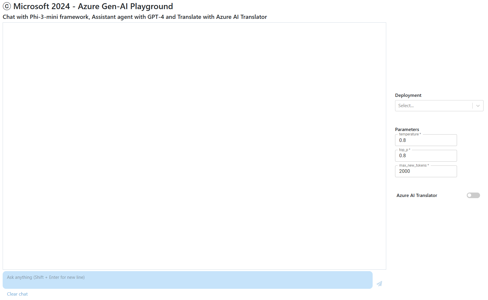

# Getting Started with Azure AI Phi-3 Chat API, GPT-4 Assistants API and Azure Translator

## Overview
This is a lightweight python project to demonistrate how-to 
1. Create and manage GPT-4 assistants and threads.
2. Create Phi-3-mini chat.
3. Use Azure Translator to complement the model translation capabilities to improve the low resource languages translation quality.
4. Use fast python async calls with Quart and Uvicorn.
   
## Requirements
- [optional] Install VS code
- Install node.js and npm using https://nodejs.org/dist/v22.1.0/node-v22.1.0-x64.msi
- Clone this repo 
- Launch VS code
- Select the project folder
- Start VS code terminal and run the following install commands: 
  - npm install
  - npm install @mui/material @emotion/react @chatscope/chat-ui-kit-react
  - npm install react-select
  - python -m pip install -r requirements.txt
  
## .env must be added to the root directory:
- modify ".env_template" and rename to ".env"

## Launch the app
1. Start VS code and open the app folder from "File" tab
2. Create 2 terminals
3. In terminal 1 run and wait: python -m uvicorn app:app  --port 5000 --reload
   - Wait for Application startup complete.
4. In terminal 2 run: npm start
   - You should see:
   

#### You can:
1. Type query in Ask anything.
2. Use slider switch for Azure AI Translator.
3. Select deployment model (phi-3-mini-4k-instruct as an example for chat and GPT-4 for assistants).
4. Change query paramters as needed.
5. Clear chat to remove session chat history.

#### NOTE:
- When Azure Traslator is enabled, this repo supports translation from source language to French, German, Chinese, Spanish and English.
- You can add more target lanaguages by modifying get_target_language() found in backend/gpt_2_assistant.py and backend/phi_3_assistant.py
