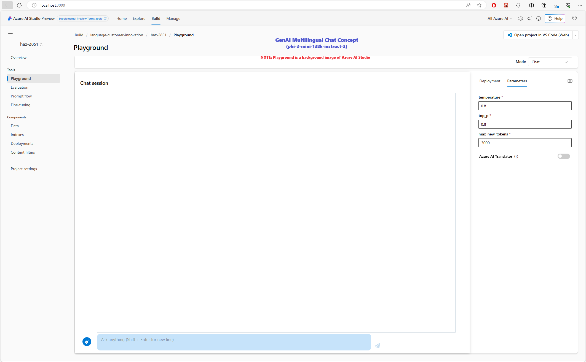

# Getting Started with Azure AI Chat API, Azure Translator and Phi-3

## Requirements
- VS code must be installed
- node.js and npm
- npm install --save-dev react-dev-u
- npm install @mui/material @emotion/react @emotion/styled
- npm install react-select
- pip install openai
- pip install requests dotenv json  ssl  urllib3
  
## .env must be added to the root directory. Content (without sub-bullet):
- MT_REGION=<resource region, e.g., eastus>
- AAI_1KEYV2=<resource key, e.g., a1b1234567890123456789ca123456c7>
- MT_URI=https://resource-name.cognitiveservices.azure.com/
- MT_BASE_URL=https://resource-name.cognitiveservices.azure.com/translator/text/v3.0
- PHI_3_URL=phi-3-model-deployment-endpoint
- PHI_3_KEY=phi-3-deployment-key

## Launch the app
1. Start VS code and open the app folder from "File" tab
2. Create 2 terminals
3. In terminal 1: "cd .\flask-app\" and start flask "python -m flask run"
4. In termina 2: start npm "npm start"
   You should see:
   

#### You can:
1. Type query in Ask anything.
2. Use slider switch for Azure AI Translator.
3. Select deployment model (phi-3-mini-128k-instruct-2 as an example).
4. Change query paramters.
