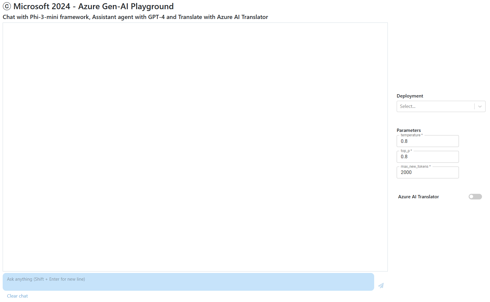

# Getting Started with Azure AI Phi-3 Chat API, GPT-4 Assistants API and Azure Translator

## Requirements
- VS code must be installed
- install python using https://www.python.org/downloads/release/python-3123/
- [recommended: creating virtualenv] python -m venv ./my_venv
- install node.js and npm using https://nodejs.org/dist/v22.1.0/node-v22.1.0-x64.msi
- Following is best to be run from VS Code terminal after you select the project folder. 
  - npm install --save-dev react-dev-utils
  - npm install @mui/material @emotion/react @emotion/styled @chatscope/chat-ui-kit-react
  - npm install react-select
  - pip install Flask==2.3.2
  - pip install openai==1.6.1
  - pip install python-dotenv==1.0.0
  - pip install requests urllib3
  
## .env must be added to the root directory:
- edit .env_template
- rename .env_template .env

## Launch the app
1. Start VS code and open the app folder from "File" tab
2. Create 2 terminals
3. In terminal 1: "cd .\flask-app\" and start flask "python -m flask run"
4. In termina 2: start npm "npm start"
   - You should see:
   

#### You can:
1. Type query in Ask anything.
2. Use slider switch for Azure AI Translator.
3. Select deployment model (phi-3-mini-128k-instruct-2 as an example for chat and GPT for assistants).
4. Change query paramters.
5. Clear chat.
